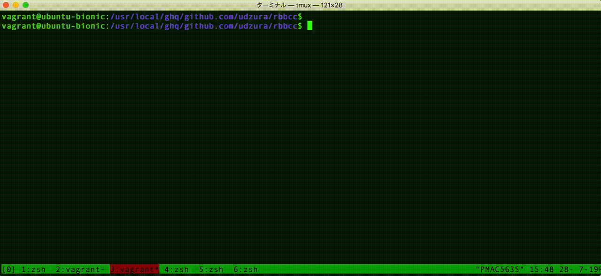

# RbBCC

[](https://badge.fury.io/rb/rbbcc) [](https://github.com/udzura/rbbcc/actions?query=workflow%3ATests)

RbBCC is a port of [BCC](https://github.com/iovisor/bcc) in MRI. See iovisor project page.



This gem requires `libbcc.so`. Please install it [following BCC's instruction](https://github.com/iovisor/bcc/blob/master/INSTALL.md).

## Installation

Add this line to your application's Gemfile:

```ruby
gem 'rbbcc'
```

And then execute:

    $ bundle

Or install it yourself as:

    $ gem install rbbcc

## Usage

```ruby
require 'rbbcc' 

code = <<CLANG
int kprobe__sys_clone(void *ctx)
{
  bpf_trace_printk("Hello, World!\\n");
  return 0;
}
CLANG
RbBCC::BCC.new(text: code).trace_print
```

See examples (both in rbbcc and BCC)

## Trying with docker

[`udzura/rbbcc:${version}` is available.](https://hub.docker.com/r/udzura/rbbcc)

* On generic linux:

```console
$ docker run --privileged \
    -v/lib/modules:/lib/modules \
    -v/sys:/sys \
    -v/usr/src:/usr/src \
    -v`pwd`:/opt \
    -ti \
    udzura/rbbcc:0.0.2 /opt/hello_world.rb
Found fnc: kprobe__sys_clone
Attach: p_sys_clone

            bash-20113 [000] ....   377.602655: 0x00000001: Hello, World!
            bash-20113 [000] ....   385.367309: 0x00000001: Hello, World!
            bash-20113 [000] ....   391.203779: 0x00000001: Hello, World!
            curl-20316 [001] ....   391.218226: 0x00000001: Hello, World!
            bash-20113 [000] ....   402.528271: 0x00000001: Hello, World!
 docker-containe-20236 [000] ....   403.090058: 0x00000001: Hello, World!
...
```

* On Docker for Mac:
  * Docker for Mac host does not have heders file in `/usr/src`, so you should extract headers in each container inside.

```console
### I have prepared an example Dockerfile
$ docker build -t udzura/rbbcc:0.0.2-dfm -f Dockerfile.dfm-example .
$ docker run --privileged \
    -v/lib/modules:/lib/modules \
    -v`pwd`/examples:/opt \
    -ti \
    udzura/rbbcc:0.0.2-dfm /opt/hello_world.rb
...
 containerd-shim-4932  [002] d...  1237.795421: : Hello, World!
           httpd-4958  [000] d...  1237.795666: : Hello, World!
           httpd-4958  [000] d...  1237.795794: : Hello, World!
           httpd-4967  [000] d...  1237.795988: : Hello, World!
           httpd-4967  [000] d...  1237.796211: : Hello, World!
           httpd-4967  [000] d...  1237.796289: : Hello, World!
           httpd-4967  [000] d...  1237.796325: : Hello, World!
           <...>-5025  [003] d...  1237.796956: : Hello, World!
            runc-5025  [003] d...  1237.797133: : Hello, World!
           httpd-4967  [000] d...  1237.797156: : Hello, World!
           httpd-4967  [000] d...  1237.797198: : Hello, World!
           httpd-4967  [000] d...  1237.797340: : Hello, World!
            runc-5025  [003] d...  1237.797464: : Hello, World!
```

## Documents

See [docs/](docs/) for getting started and tutorial.

## Development

After checking out the repo, run `bin/setup` to install dependencies. You can also run `bin/console` for an interactive prompt that will allow you to experiment.

To install this gem onto your local machine, run `bundle exec rake install`. To release a new version, update the version number in `version.rb`, and then run `bundle exec rake release`, which will create a git tag for the version, push git commits and tags, and push the `.gem` file to [rubygems.org](https://rubygems.org).

## Contributing

Bug reports and pull requests are welcome on GitHub at https://github.com/udzura/rbbcc.
